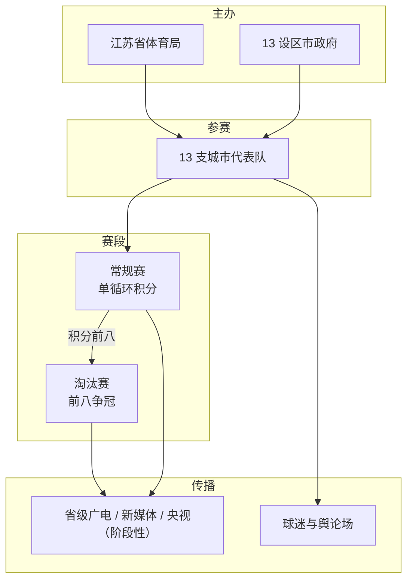
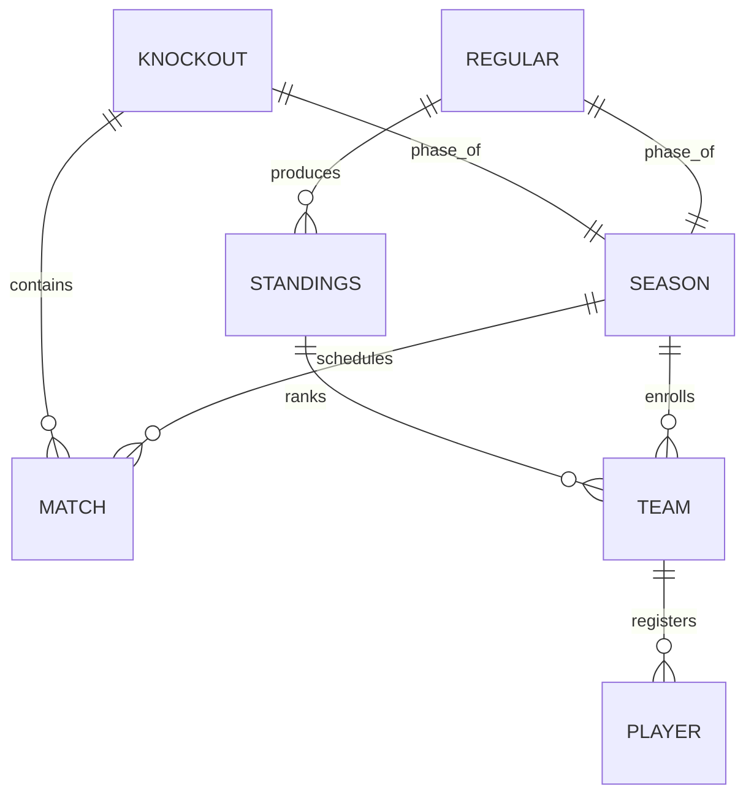

# 江苏省城市足球联赛（苏超）知识包（2026-05-03）

## 1. 系统定位

「苏超」是民间对 **江苏省城市足球联赛** 的简称，由 **江苏省体育局** 联合省内 **13 个设区市人民政府** 自 **2025 年** 起举办。每个设区市组建一支以城市命名的代表队，赛事分 **常规赛** 与 **淘汰赛** 两阶段，是国内少见的「全省城市代表队 + 高话题度」足球 IP。

- **参与主体**：13 支城市队（常被称作「十三太保」）；球员构成含职业球员与个体工商户、大学生、高中生等业余球员（公开资料表述）。
- **运营与传播**：联赛设官方信息与转播体系（如江苏广电公共信号、央视多阶段介入）；文化层面因网络梗（如常州队相关调侃）进一步破圈。
- **时间跨度**：2025 首届约 7 个月；2026 赛季公开报道称延长至约至 **10 月**，常规赛比赛日多安排在 **周六**。

## 2. 概念表

| 术语 | 定义（≤ 30 字） | 别名 / 缩写 | 出处 |
| --- | --- | --- | --- |
| 江苏省城市足球联赛 | 省级城市代表队足球联赛，2025 年起举办 | 苏超 | [维基百科](https://zh.wikipedia.org/wiki/%E6%B1%9F%E8%8B%8F%E7%9C%81%E5%9F%8E%E5%B8%82%E8%B6%B3%E7%90%83%E8%81%94%E8%B5%9B) |
| 十三太保 | 江苏 13 设区市各一队参赛的俗称 | 13 支队 | 同上；媒体报道常用 |
| 常规赛 | 13 队主客场单循环，决出积分排名 | 循环赛 | [维基百科](https://zh.wikipedia.org/wiki/%E6%B1%9F%E8%8B%8F%E7%9C%81%E5%9F%8E%E5%B8%82%E8%B6%B3%E7%90%83%E8%81%94%E8%B5%9B)；[江苏省政府网要闻](https://www.jiangsu.gov.cn/art/2026/4/10/art_60096_11755979.html) |
| 淘汰赛 | 常规赛前八名晋级后的争冠阶段 | 八强赛及以后 | 同上 |
| 2025 赛制 | 常规赛单循环 + 淘汰赛 **单回合** 淘汰 | 首届赛制 | [维基百科](https://zh.wikipedia.org/wiki/%E6%B1%9F%E8%8B%8F%E7%9C%81%E5%9F%8E%E5%B8%82%E8%B6%B3%E7%90%83%E8%81%94%E8%B5%9B) |
| 2026 赛制 | 常规赛单循环；**1/4、半决赛主客场双回合**；决赛单场 | 新赛季调整 | [维基百科](https://zh.wikipedia.org/wiki/%E6%B1%9F%E8%8B%8F%E7%9C%81%E5%9F%8E%E5%B8%82%E8%B6%B3%E7%90%83%E8%81%94%E8%B5%9B)；[江苏省政府网要闻](https://www.jiangsu.gov.cn/art/2026/4/10/art_60096_11755979.html) |
| 届别冠军（2025） | 决赛泰州队击败南通队夺冠 | 应届冠军 | [维基百科](https://zh.wikipedia.org/wiki/%E6%B1%9F%E8%8B%8F%E7%9C%81%E5%9F%8E%E5%B8%82%E8%B6%B3%E7%90%83%E8%81%94%E8%B5%9B) |
| 官方网站（公开） | 赛事信息发布域名（维基信息框） | jscl.sutisport.com | [维基百科](https://zh.wikipedia.org/wiki/%E6%B1%9F%E8%8B%8F%E7%9C%81%E5%9F%8E%E5%B8%82%E8%B6%B3%E7%90%83%E8%81%94%E8%B5%9B) |

## 3. 系统关系

### 3.1 组织与赛段关系

**解读**：行政与体育主管部门联合地方政府组队办赛；赛事实质由「全员循环」筛选出八强后进入淘汰争冠；传播链条与大众话题相互放大。

### 3.2 赛季要素（实体视角）

**解读**：赛季由大量场次构成；球队注册球员后参与常规赛产生积分榜；积分决定淘汰赛席位与对阵路径（具体抽签与规程细节以官方竞赛规程为准，本包未展开）。

## 4. 核心流程

### 4.1 常规赛：积分与八强产生

- **触发**：新赛季开赛（2026 公开信息：揭幕战约 **4 月 11 日**起，常规赛持续至约 **9 月**）。
- **前置**：13 市代表队报名完成，赛程与主场确认。
- **步骤**：每轮按赛程对阵；13 队双循环中的单循环阶段共 **13 轮**，每队 **6 主 6 客**（2025/2026 公开描述）；按胜负平累积积分。
- **关键分支**：若积分相同，按相互战绩、净胜球等规则排序（维基援引江苏省体育局排名规则）。
- **后置**：常规赛结束时积分 **前八** 进入淘汰赛（2025 描述）。
- **失败模式**：无非「淘汰」概念，但排名靠后失去争冠资格；极端天气或场地因素可能导致改期（需查官方公告）。

### 4.2 淘汰赛：从八强到冠军

- **触发**：常规赛收官，八强名次确定。
- **前置**：对阵抽签或规程已定（细节见当年官方文件）。
- **步骤（2025）**：单回合淘汰直至决赛。
- **步骤（2026 调整）**：**四分之一决赛、半决赛** 采用 **主客场双回合**；**决赛** 仍为 **单场决胜**（公开报道与维基一致口径）。
- **关键分支**：双回合以总比分晋级；若总比分打平需按规程进行加时/点球等（规程细节未在本包逐条核实）。
- **后置**：产生赛季冠军；转播与商务结算进入收尾。
- **失败模式**：场次冲突、舆情与安保等运营风险需主办方预案（非技术流程）。

### 4.3 传播与文化反馈（辅线）

- **触发**：赛事进程与城市对抗话题。
- **步骤**：省级平台制作公共信号 → 多地电视台与网络平台分发 → 央视在 **2025 淘汰赛阶段** 等节点介入电视直播（维基「赞助与转播」一节）。
- **后置**：网络迷因与城市形象互动（如常州队相关笔画梗，维基「文化」一节）。
- **失败模式**：侵权、过激调侃引发声誉风险，需官方与平台协同处置。

## 5. 文档 vs 代码差异

| 主题 | 文档说法 | 代码实现 | 建议 |
| --- | --- | --- | --- |
| 本知识包性质 | 基于公开网页与百科摘要 | **无**对照代码库 | 若需「竞赛规程级」精度，应下载当年官方 PDF 并替换本包第二节赛程描述 |
| 场次总数 | 2025 约 **85** 场；2026 总计 **91** 场（维基） | — | 报道口径可能随预备赛/开幕式是否计入而变化，引用时注明来源与日期 |
| 球员数据 | 2026 赛季媒体报道「平均年龄」「U22 占比」等 | — | 数字随官方统计局口径波动，写作引用须给出来源链接 |

**结论**：已逐项核对，**无**软件代码差异可记；存在「不同媒体对场次统计口径」类差异，以 **江苏省体育局 / 省政府发布** 为优先权威来源。

## 6. 未覆盖与后续问题

- 未收录：**竞赛规程全文**、**球员注册与转会细则**、**纪律处罚条款**、**商务赞助合同结构**。
- 未核实：2026 季后赛具体抽签规则、加时点球细则、场地标准版本号。
- 积分榜：维基内嵌积分榜具有 **单日快照** 性质，**勿**当作赛季最终排名引用。
- 若需与「中超联赛」等名称并存场景写作：注意「苏超」为 **江苏省城市足球联赛** 昵称，避免与历史或其他地域赛事简称混淆。

## 7. 出处索引

- Web: [江苏省城市足球联赛（中文维基）](https://zh.wikipedia.org/wiki/%E6%B1%9F%E8%8B%8F%E7%9C%81%E5%9F%8E%E5%B8%82%E8%B6%B3%E7%90%83%E8%81%94%E8%B5%9B)
- Web: [江苏省人民政府 · 周六开赛！2026「苏超」相关报道（2026-04-10）](https://www.jiangsu.gov.cn/art/2026/4/10/art_60096_11755979.html)
- Code: 无

完整 URL 清单与同目录 `sources.json` 同步。
